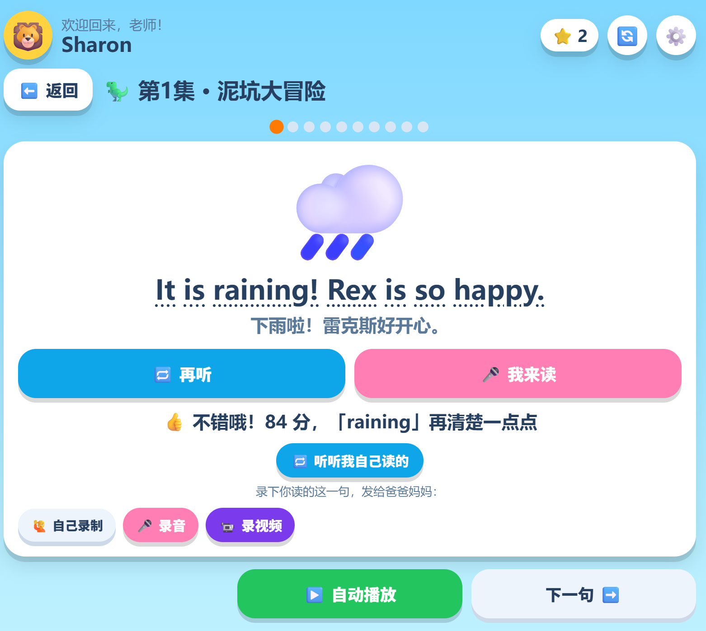
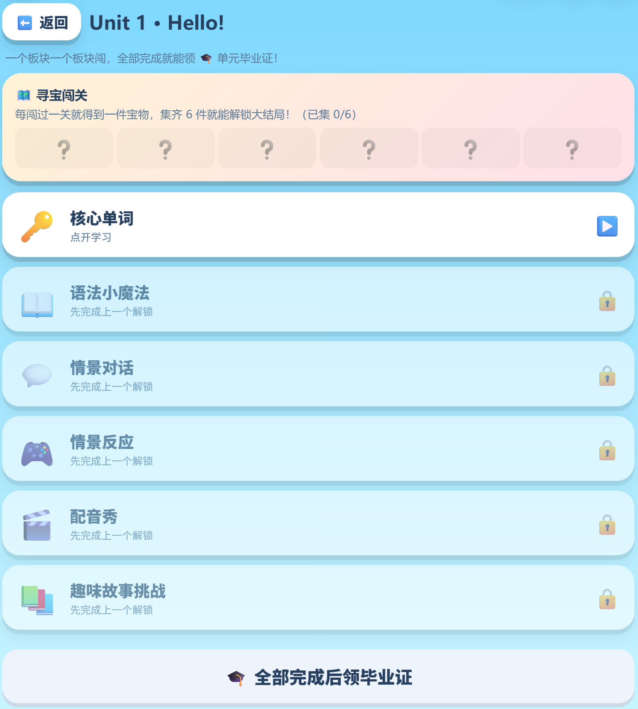

# 快乐英语岛 · Happy English Island

> 一个让零基础孩子 **不怕英语、敢开口** 的儿童英语学习 Web 应用。
> 🔗 在线体验：https://sharon-yanrong.github.io/English/

为帮英语零基础的小外甥启蒙而独立设计开发。核心不是“多背单词”，而是先让孩子 **爱听、敢开口、有自信**，再自然地学会表达。**开口 / 交流优先，教材同步为辅。**

---

## ✨ 主要功能

- 🎤 **AI 发音评测** —— 孩子跟读，用微软发音评测给 0–100 真实分数 + 逐词反馈，转成“鼓励式”话术（高分给星星、点名最弱的词）。
- 🔊 **AI 好听声音** —— Azure 神经语音（自然童声、多种可选、可试听），替代生硬的机器音。
- 📗 **课本同步课（游戏化）** —— 按真实教材（冀教版三上）分 Unit；每单元含单词 / 语法 / 对话 / 情景 / 配音 / 故事多个板块，闯关解锁、集齐宝物领“单元毕业证”。
- 📖 **听故事** / 🔤 **自然拼读** / 🌍 **国家小揭秘** / 🗣️ **聊天话题** / 🎮 **8 个小游戏** —— 磨耳朵、口语、拼读、拓展、寓教于乐。
- 📬 **跨设备家庭消息** —— 孩子把跟读的语音 / 视频发到“房间”，家长、老师隔空收听回复；消息按日期分隔、按月折叠。
- 🏆 **真实奖励 + 家长后台** —— 家长设任务、真实奖励目标，孩子攒星达标提示“找爸妈领奖”。

## 🖼 截图

| 首页 | 发音评测 | 单元闯关 |
|---|---|---|
|  |  |  |

## 🧱 技术栈

单文件 `index.html`（原生 JS，无框架、可离线学习）· GitHub Pages 部署 · Azure 神经语音 & 发音评测 · Supabase（家庭消息 / 文件存储 / Edge Function）。

## 🏗 架构 & AI 要点

- 浏览器直连两类后端：**Azure**（神经语音 + 发音评测）与 **Supabase**（家庭消息 / 存储）。
- **中国网络友好**：不依赖第三方 CDN 与 SDK，全部改为 `fetch` 直连 REST + 轮询。
- **发音评测流程**：浏览器录 16kHz 单声道 WAV → Azure 评测 API → 分数 + 逐词 → 鼓励式反馈 + 星星。
- **优雅降级**：Azure 慢 / 断 → 自动改用本地发音，绝不卡住 / 静音；进屏预缓存让点读“秒响”；手机首次点击解锁音频。

## 🔒 隐私 & 版权

- 语音 / 评测密钥由每台设备在设置里自行填写，**不写入代码、不进公开仓库**。
- 内容 **全原创**（自创角色 Pup 🐶 / Kit 🐱 等），仅借用教材的词汇与知识点，不使用教材人物、原文与插画。

## 🚀 本地运行

直接用浏览器打开 `index.html` 即可浏览（麦克风类功能需在 `https` 或 `localhost` 下）。或启动本地服务器：

```bash
python -m http.server 8000
# 然后访问 http://localhost:8000
```

## 👤 作者

周艳蓉 · 独立设计与开发（0→1：需求 · 设计 · AI 集成 · 部署 · 迭代）。
